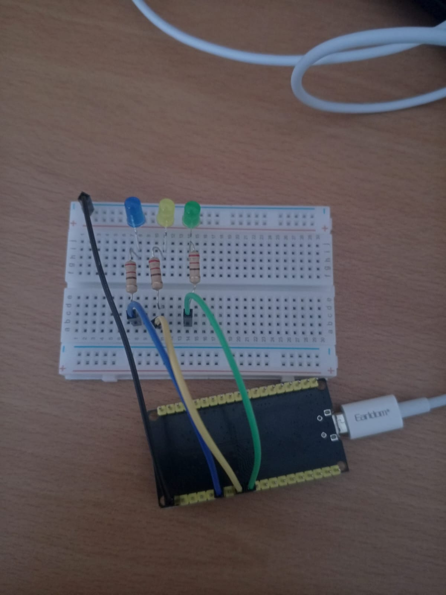
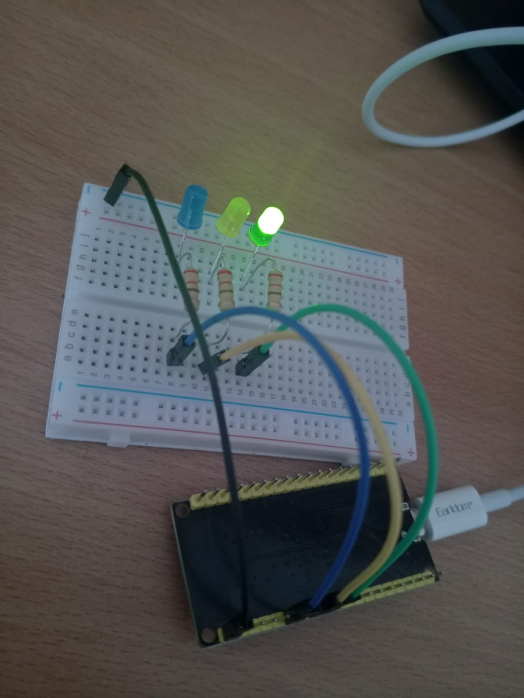

# Séquence de LEDs avec ESP32

## Description

Ce projet fait partie de mes premiers travaux réalisés avec l’ESP32 dans le cadre de mon apprentissage des systèmes embarqués et de l’Internet des Objets (IoT).

L’objectif est de contrôler plusieurs LEDs à l’aide des broches GPIO de l’ESP32 et de comprendre la gestion du temps dans un programme embarqué.

Le montage utilise trois LEDs (verte, jaune et bleue) connectées à un ESP32. Les LEDs s’allument successivement selon une séquence prédéfinie : la LED verte reste allumée pendant 5 secondes, la LED jaune pendant 2 secondes, puis la LED bleue pendant 5 secondes. Une fois la séquence terminée, le cycle recommence automatiquement.

Ce projet m’a permis de me familiariser avec le câblage sur breadboard, l’utilisation des résistances, la programmation de l’ESP32 avec l’IDE Arduino et les bases de l’électronique numérique.

## Composants utilisés

* ESP32 WROOM-32
* Breadboard
* LED verte
* LED jaune
* LED bleue
* 3 résistances de 220 Ω
* Fils de connexion (jumper wires)

## Fonctionnement

1. La LED verte s’allume pendant 5 secondes.
2. La LED jaune s’allume pendant 2 secondes.
3. La LED bleue s’allume pendant 5 secondes.
4. La séquence se répète indéfiniment.

## Compétences acquises

* Programmation de l’ESP32
* Utilisation des GPIO
* Gestion des temporisations avec `delay()`
* Réalisation de montages sur breadboard
* Utilisation de l’IDE Arduino
* Bases de l’électronique embarquée

## Images du projet

### Schéma de câblage

### Réalisation finale

## Auteur

Moemen Bannani

Étudiant en Internet of Things (IoT)
